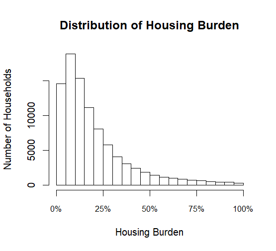

# Housing Burden and Insurance Expenditures

## Project Overview 
 
This project examines the relationship between household housing 
burden and insurance expenditures using household-level data from 
the Bureau of Labor Statistics Consumer Expenditure Surveys. 
 
The analysis examines four categories of insurance: 
 
- Vehicle insurance 
- Life insurance 
- Personal insurance 
- Health insurance

## Research Question 
 
How is housing burden associated with household insurance 
expenditures?

## Data 
 
The dataset contains 91,992 household observations and 31 variables. 
 
The analysis uses Consumer Expenditure Survey data covering 
Q2 2018 through Q1 2024. 
 
Key variables include: 
 
- Housing burden 
- Age 
- Family size 
- Marital status 
- Race 
- Education 
- Housing tenure 
- Work hours 
- State 
- Insurance expenditures 
- Insurance related expenditures

## Data Preparation 
 
The dataset was compiled and cleaned in Excel before being 
analyzed in R. 
 
Housing burden is defined as mandatory housing expenditures 
divided by gross income. 
 
Observations with housing burden values below 0 or above 1 
were removed during data preparation.

## Methods 
 
Four linear regression models were estimated for vehicle, 
life, personal, and health insurance expenditures. 
 
The models include demographic and socioeconomic controls, 
state fixed effects, quarter, and insurance-specific expenditure 
controls. 
 
Insurance expenditure variables are adjusted to account for 
zero-expenditure observations and are modeled using their 
logarithmic transformation.

## Key Findings 
 
Housing burden was positively associated with vehicle and life 
insurance expenditures, but negatively associated with personal 
and health insurance expenditures. 
 
| Insurance Type | Housing Burden Coefficient | 
|---|---:| 
| Vehicle | 2.127 | 
| Life | 0.482 | 
| Personal | -0.742 | 
| Health | -0.538 | 

## Model Fit 
 
| Model | R-squared | 
|---|---:| 
| Vehicle Insurance | 0.127 | 
| Life Insurance | 0.083 | 
| Personal Insurance | 0.542 | 
| Health Insurance | 0.248 | 
 
## Visualizations 
 
### Housing Burden Distribution 
 
 
 
## Limitations 
 
Housing burden may be related to broader financial behavior 
and other factors that are not fully captured by the models. 
Behavioral preferences may also influence insurance decisions. 
 
## Tools 
 
- R 
- Excel 
- GitHub 
 
## Repository Structure 
 
- `data/` — cleaned dataset 
- `R/` — R analysis and visualization code 
- `figures/` — portfolio visualizations 
- `results/` — regression results 
- `report/` — project documentation 
